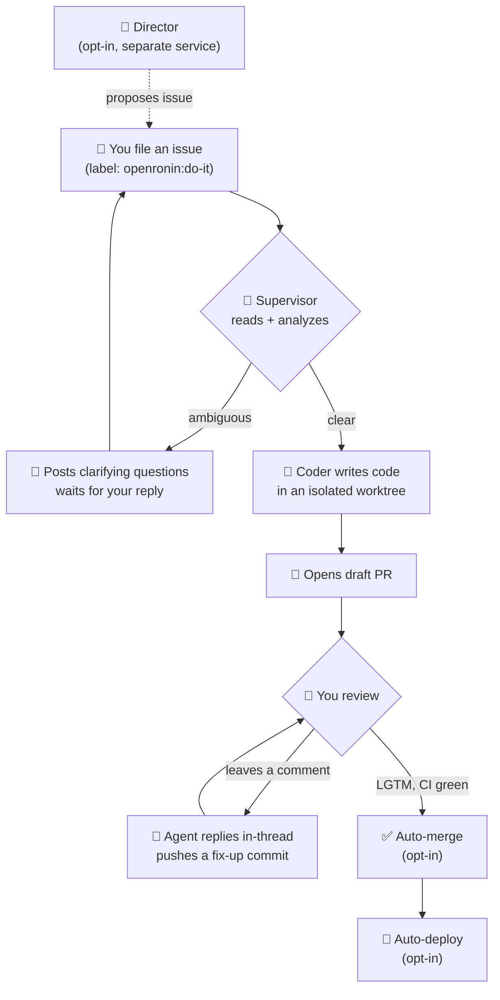
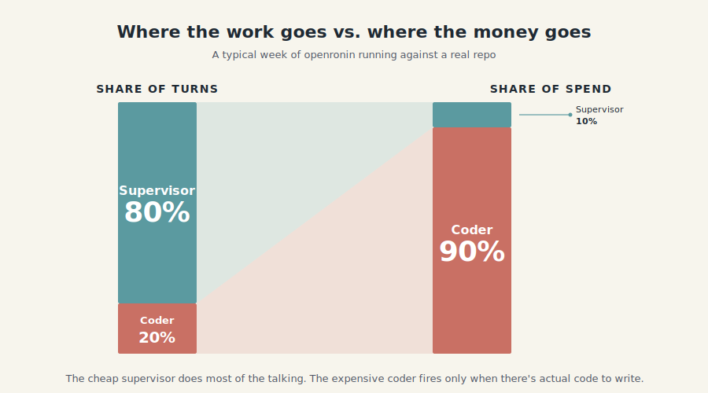
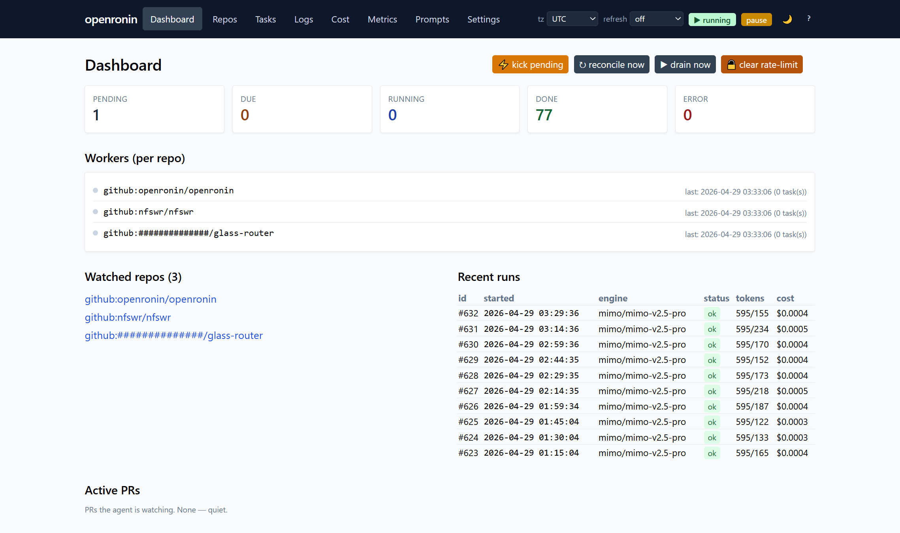

<div align="center">


# openronin

**Your AI dev teammate that lives on GitHub.**

File issues like you'd brief a remote developer. The agent picks them up, asks for clarification when it needs to, opens pull requests with the work, replies to your code review comments, resolves merge conflicts, and ships when it's ready.

[Quickstart](#quickstart) · [A day in the life](#a-day-in-the-life) · [Admin UI](#what-you-get-to-look-at) · [Lanes](docs/LANES.md) · [Configuration](docs/CONFIG.md) · [FAQ](#faq)

[](LICENSE)
[](https://nodejs.org/)
[]()
[](https://github.com/openronin/openronin/stargazers)

</div>

---

## What it does

**Treat it like a remote developer on your team.**

You write tickets. It writes code. You review PRs. It addresses your comments. The whole loop runs on the GitHub workflow you already have — issues, pull requests, threaded reviews, labels, reactions. Nothing new to learn, no new chat window, no console to babysit.

Specifically, the agent will:

- 🎯 **Pick up issues** as soon as you label them — by default, `openronin:do-it`
- 🤔 **Read the whole thread** and ask clarifying questions if the requirements are ambiguous (then wait for your reply before starting)
- 💻 **Write the code** in an isolated working copy of your repo and **open a draft pull request**
- 💬 **Reply to your review comments** in-thread, push fix-up commits, mark conversations as resolved
- 🔧 **Resolve merge conflicts** by rebasing and editing the conflict markers itself
- ✅ **Auto-merge** the PR when all your comments are addressed and CI is green *(opt-in)*
- 🚀 **Deploy** the merged change to your server *(opt-in)*

Everything happens on GitHub. You see every action as a normal commit, comment, reaction, or label change — no black boxes.

## A day in the life

```
09:14   you      Open issue #42: "Add CSV export to /reports"
09:14   bot      🤖 Adds 'in-progress' label, posts: "Got it. Two questions before I start:
                 (1) which columns should be in the CSV — same as the table view, or
                 a configurable subset? (2) include a 'generated_at' header?"
                 Sets 'awaiting-answer' label.

09:30   you      Reply: "Same columns as the table. No header, just the data."

09:31   bot      🤖 Removes 'awaiting-answer'. Starts working.

09:47   bot      🤖 Pushes branch openronin/issue-42, opens draft PR #43:
                 "Adds /reports/export.csv endpoint and 'Export CSV' button.
                  Streamed to handle large result sets. Tests added. Closes #42."

09:58   you      Inline review on the streaming code: "Use ReadableStream
                 instead of building a string."

10:00   bot      🤖 Reacts 👀 to the comment.

10:08   bot      🤖 Replies in-thread: "Switched to ReadableStream — see commit a3f9b2c.
                 Also adjusted the test to drain the stream rather than reading it
                 as a single string." Pushes the new commit. Resolves the thread.

10:09   bot      🤖 Reacts 👍 to the original comment.

10:14   ci       All checks passed.

10:15   bot      🤖 No unresolved threads, mergeable, CI green — squash-merging.
                 Closes #42. (auto-merge was opted in for this repo.)
```

That entire flow happens without you visiting any UI besides GitHub. The agent is just another `@mention` that ships code.

## How it works



Three layers, split by role and cost:

- **Director** *(opt-in, separate service).* Reads a per-repo charter and proposes what to work on next. Never edits code. Lives at `/admin/director`. See [docs/DIRECTOR.md](docs/DIRECTOR.md).
- **Supervisor.** Reads issues, classifies, asks clarifying questions, plans. Cheap and fast — handles the bulk of the conversational work.
- **Coder agent.** The only thing allowed to mutate code, and only inside an isolated worktree.

Both are pluggable:

- **Supervisor:** any **OpenAI-compatible API**. We test against [Xiaomi MIMO](https://hyper.xiaomi.com/) (cheap, ~$0.40 per 1M input tokens) and the Anthropic API. OpenAI, xAI / Grok, DeepSeek, Together, Groq, or your local Ollama all work — anything that speaks the OpenAI Chat Completions protocol drops in.
- **Coder:** [Claude Code](https://docs.claude.com/en/docs/claude-code) today. [OpenCode](https://github.com/opencode-ai/opencode), [Codex CLI](https://github.com/openai/codex), and direct-API coder modes are on the roadmap.

That split keeps cost low while quality stays high. Most issues never make it to the coder if they need clarification first; the cheap engine handles that conversation alone.

<div align="center">
  
</div>

## What you get to look at

A pragmatic admin UI ships with the daemon. HTMX + Tailwind, server-rendered, no SPA build step. Open `http://localhost:8090/admin` and you have:

<div align="center">
  
</div>

- **📊 Dashboard** — queue depth, active tasks, recent runs, recent errors at a glance
- **💵 Cost dashboard** — per-day, per-lane, per-model, per-repo spend charts. See exactly where your tokens go.
- **🔬 Task drill-down** — every task's full timeline: prompt sent to the model, the model's response, the resulting diff, lane routing decisions, run history. No black boxes.
- **🔀 Open PRs** — iteration count, last activity, one-click kick to re-run a stalled task
- **⚙️ Workers panel** — live busy/idle indicator per watched repo, last-run timestamps
- **📜 Audit log** — every admin action (kick, drain, pause, deploy, clear-rate-limit) persisted to its own table
- **🏷️ Repo settings** — per-repo YAML editor with hot-reload, label one-click setup, annotated deploy config example generator
- **📡 Webhook info panel** — copy-paste payload URL, secret, and event list for repos where the bot doesn't have admin to set the hook itself

Plus: dark mode, mobile nav, command palette (Cmd-K), keyboard shortcut overlay (`?`), configurable timezone, configurable refresh rate, pause toggle in the header.

The same data is exposed via a JSON API at `/api/*` (Bearer token auth), and a stdio **MCP server** ships in the box — bridge openronin to Claude Desktop, IDE plugins, or any MCP-compatible client.

## Built to run unattended

- **Per-repo isolated workers.** A long task in repo A doesn't block repo B. Graceful shutdown waits for in-flight work.
- **Crash recovery.** If the daemon dies mid-task, on restart it resumes the task. Auto-abandons after 3 consecutive recoveries to prevent loops.
- **Cost guardrails.** Hard kill-switches at configurable per-task and per-day USD limits.
- **Rate-limit aware.** Parses Claude Code 429s, sleeps until the reset moment surfaced by the API.
- **Tells you when it's stuck.** `awaiting-answer`, `awaiting-action`, `needs_human` labels mark every dead-end. No silent failures.
- **Pause switch.** Drop a `.PAUSE` file (or click the toggle in the admin header) and the scheduler stops dispatching new work. Live tasks finish.
- **Backups built in.** Hourly SQLite snapshots + daily off-host rsync via shipped systemd timer units.
- **Self-deploys itself.** With `KillMode=process` in the systemd unit and the deploy lane configured, the agent ships its own changes including its own restart.

## Lanes

Tasks travel through **lanes**. Each lane has a trigger, an engine, and an output:

| Lane | When it runs | Engine | What it produces |
|---|---|---|---|
| **triage** | new issue or PR | supervisor | classification + labels |
| **analyze** | issue gets `openronin:do-it` | supervisor | clarifying questions OR expanded requirements |
| **patch** | analyze said `ready` | coder | a draft PR |
| **patch_multi** *(opt-in)* | same trigger | coder + reviewer | PR with critique loop |
| **pr_dialog** | new comment on agent's PR | coder | threaded reply + fix-up commit |
| **conflict_resolve** *(opt-in)* | mergeable=false | coder | rebased + edited + force-pushed |
| **auto_merge** *(opt-in)* | all replies addressed, CI green | — | squash-merge + close |
| **deploy** *(opt-in)* | push to trigger branch | shell | run configured commands |

The router is a single function (`pickLane` in `src/scheduler/worker.ts`) — no opaque agent loop deciding what's next.

## Director — autonomous PM (opt-in)

Want the agent to also pick *what* to work on, not just execute issues you file? There's a separate **Director** service that reads a per-repo charter (vision, priorities, definition-of-done, out-of-bounds zones) and proposes work items autonomously. It runs as its own systemd unit, has its own adaptive budget, and writes everything it does to a chat thread you can read at `/admin/director`.

Five autonomy levels — `disabled` → `dry_run` → `propose` → `semi_auto` → `full_auto`. Start in `dry_run` for a few days to calibrate the charter; ramp up as confidence grows. Default authority is conservative (no merging, no closing issues, no charter modification without explicit opt-in).

See [docs/DIRECTOR.md](docs/DIRECTOR.md) for the full schema and rollout plan.

Full reference: **[docs/LANES.md](docs/LANES.md)**.

## What you need

- A server (any Linux box, Node 22+, 1 GB RAM is plenty)
- A GitHub account for the bot to push from — a separate account is recommended. A Personal Access Token is enough; no GitHub App required.
- **A coder.** [Claude Code](https://docs.claude.com/en/docs/claude-code) is the default — install the CLI, run `claude` once to log in. A Max subscription works.
- **A supervisor LLM key.** Anything OpenAI-Chat-Completions-compatible. Tested: Xiaomi MIMO, Anthropic API. Drops in: OpenAI, xAI, DeepSeek, Together, Groq, local Ollama.

## Quickstart

```bash
git clone https://github.com/openronin/openronin.git
cd openronin
pnpm install
cp .env.example .env
# edit .env — at minimum: GITHUB_TOKEN, a supervisor LLM key, ADMIN_UI_PASSWORD
pnpm build
pnpm start
```

Open `http://localhost:8090/admin`, add a repo, the agent starts watching.

Step-by-step (webhooks, labels, first-PR walkthrough): **[QUICKSTART.md](QUICKSTART.md)**.

## Why openronin

There's a healthy lineup: Aider, Sweep, Cursor, Devin, OpenHands, SWE-agent, Cline. Most are either **interactive** (you sit there and prompt it through each step) or **closed SaaS** (your code, someone else's servers, someone else's prompts).

`openronin` is what you'd build if you wanted **a remote teammate, not a tool**: a process you start once, point at your repos, and forget. You own the server, the database, the prompts, the models, and the work. The bot has been dog-fooded on this repo — most lanes after the bootstrap were shipped by the bot itself.

## Status

**Alpha.** The author has been running it in production on a handful of personal repos. It works. Some rough edges still being smoothed:

- Documentation is being expanded; some `docs/*.md` are terse
- The admin UI is pragmatic, not pretty (HTMX + Tailwind CDN, server-rendered)
- Tested mainly on GitHub. The GitLab provider is implemented but less battle-tested.
- An interactive `init` wizard is on the roadmap; first-time setup currently requires editing `.env` and one YAML file by hand.

If something breaks, **file an issue**.

## Roadmap

- [ ] **More coders** — [OpenCode](https://github.com/opencode-ai/opencode), [Codex CLI](https://github.com/openai/codex), and direct-API coders (raw Anthropic / OpenAI / xAI without a CLI dependency)
- [ ] **Multi-agent expansion** — dedicated reviewer, planner, fixer roles
- [ ] **GitHub App migration** — replace PAT with GitHub App for higher-throughput repos
- [ ] **First-class Gitea support**
- [ ] **Web dashboard polish** — replacing or layering over the current admin UI
- [ ] **Plugin system** for custom lanes
- [ ] **Interactive `openronin init` wizard**
- [ ] **Bitbucket / sourcehut providers** if there's demand

Have something to add? Open an issue or a PR.

## FAQ

**Is this a GitHub App?** No, it's a self-hosted daemon you run on your own server. It uses a Personal Access Token to push as the bot user. A GitHub App version is on the roadmap.

**Does it call OpenAI?** Only if you point it at OpenAI. The supervisor is any OpenAI-compatible API (Xiaomi MIMO, Anthropic, OpenAI, xAI, DeepSeek, Groq, local Ollama, ...). The coder is Claude Code today; OpenCode and Codex CLI are on the roadmap. You own the choice.

**Can I review before it merges?** Yes — auto-merge is opt-in per repo. With it off, the agent opens the PR, iterates on your comments, and waits for *you* to merge.

**Does it work for non-trivial features?** It's reliable for clear, well-scoped tasks (bug fixes, small additions, refactors). Vague or research-heavy tasks it'll either ask for clarification or punt to a `needs_human` state.

**What happens if it screws up?** Branch protection still applies. CI still runs. Auto-merge requires checks to pass. Worst case: a draft PR sits open with broken code that never gets merged. You see it, you close it, you file a better issue.

**Is the bot itself written by AI?** Substantially, yes. Most lanes after the bootstrap were merged via the bot's own pipeline.

## Contributing

See [CONTRIBUTING.md](CONTRIBUTING.md). The fastest contribution path: file an issue describing what's wrong or missing. If you want to write code yourself, run the lint/test/format check before pushing:

```bash
pnpm run check
```

## License

[MIT](LICENSE)
